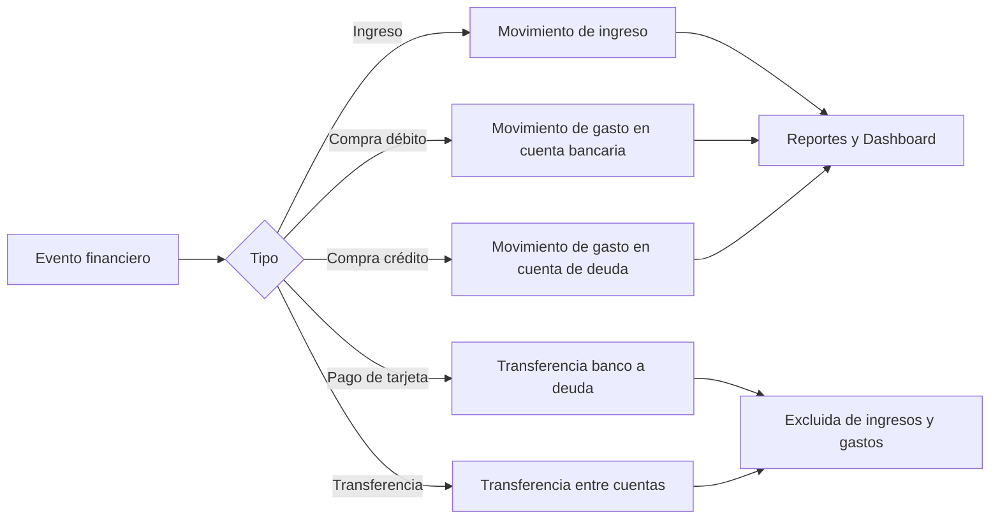

# Flujo contable de FinanceOS

Este documento define qué registro se crea por cada operación y cómo afecta saldos, ingresos, gastos, deudas y patrimonio. Es la referencia para mantener el mismo comportamiento en web, móvil y API.

## Regla central

```text
Patrimonio neto = activos disponibles + inversiones − deudas
Balance del mes = ingresos − gastos
```

Una operación económica debe afectar ingresos o gastos una sola vez. Las transferencias únicamente redistribuyen saldos y quedan excluidas de ingresos y gastos.

## Mapa general



## Matriz de efectos

| Operación | Registros técnicos | Activos | Deuda | Ingresos | Gastos | Patrimonio neto |
|---|---:|---:|---:|---:|---:|---:|
| Ingreso de $100 | 1 movimiento | +$100 | — | +$100 | — | +$100 |
| Compra débito de $100 | 1 movimiento | −$100 | — | — | +$100 | −$100 |
| Compra crédito de $100 | 1 movimiento | — | +$100 | — | +$100 | −$100 |
| Pago de tarjeta de $60 | 1 transferencia y 2 apuntes internos | −$60 | −$60 | — | — | Sin cambio |
| Transferencia de $100 | 1 transferencia y 2 apuntes internos | Redistribución | — | — | — | Sin cambio |

Los dos apuntes de una transferencia representan salida y entrada. No son dos operaciones económicas y sus categorías se excluyen de reportes de ingresos y gastos.

## Compra detectada

1. Web, móvil o el lector de notificaciones envía el texto bancario a la API.
2. La API extrae valor, moneda, comercio, banco, tipo y últimos cuatro dígitos.
3. Se crea una `OperacionDetectada` en estado `Pendiente`. Todavía no afecta saldos.
4. La huella de banco, tarjeta, comercio, valor y fecha evita procesar dos veces el mismo aviso.
5. El usuario confirma categoría y medio de pago.
6. Se crea exactamente un movimiento de gasto y la detección pasa a `Confirmada`.

## Tarjeta débito

- Debe vincularse con una cuenta bancaria de la misma moneda.
- La compra disminuye el saldo de esa cuenta.
- El movimiento aparece una sola vez en gastos, presupuestos, reportes y flujo mensual.

## Tarjeta crédito

- FinanceOS crea una cuenta de deuda separada al registrar la tarjeta.
- La compra no disminuye una cuenta bancaria.
- El saldo negativo de la cuenta de tarjeta representa la deuda pendiente.
- El Dashboard separa esa deuda de la distribución de activos y la descuenta del patrimonio neto.

## Pago de tarjeta

- El origen es una cuenta bancaria y el destino es la cuenta de deuda.
- La salida reduce el efectivo y la entrada reduce la deuda por el mismo valor.
- El patrimonio neto no cambia al pagar.
- El pago no vuelve a aparecer como gasto porque el gasto se reconoció al realizar la compra.
- No se permite pagar más que la deuda pendiente ni mezclar monedas.

## Prevención de duplicados

- `OperacionDetectada.huella` es única por banco, tarjeta, comercio, valor y fecha.
- Una detección confirmada o descartada no puede procesarse nuevamente.
- Una tarjeta activa no puede registrarse dos veces con igual banco, tipo y últimos cuatro dígitos.
- Las transferencias tienen una entidad principal que enlaza sus apuntes de entrada y salida.
- Al eliminar una transferencia se revierten ambos apuntes y ambos saldos.
- Una cuenta con movimientos o tarjetas vinculadas no puede eliminarse.

## Dashboard

- `cuentas_cop` suma los saldos de cuentas, incluyendo las deudas como valores negativos.
- `inversiones_cop` suma el valor de mercado convertido a COP.
- `patrimonio` suma `cuentas_cop + inversiones_cop` una sola vez.
- La gráfica de distribución muestra solamente activos positivos e inversiones.
- Las deudas aparecen en una sección independiente y no se dibujan como porciones negativas.
- Ingresos y gastos consideran exclusivamente categorías `Ingreso` y `Gasto`; transferencias quedan fuera.

## Inversiones

Las posiciones existentes se registran actualmente como patrimonio externo. Para una compra nueva financiada desde una cuenta bancaria, el flujo futuro debe enlazar la cuenta de origen y reducir su saldo al incorporar la posición. Hasta implementar ese enlace, no se debe conservar simultáneamente como efectivo el dinero que ya está invertido.

## Casos que deben permanecer cubiertos por pruebas

- Compra débito actualiza una sola cuenta y un solo gasto.
- Compra crédito actualiza una sola deuda y un solo gasto.
- Pago de tarjeta mantiene el patrimonio neto y no incrementa gastos.
- Transferencia mantiene el patrimonio total.
- Aviso repetido no crea otro movimiento.
- Monedas distintas son rechazadas si no existe conversión explícita.
- Deudas no aparecen como porciones negativas en la distribución de activos.
