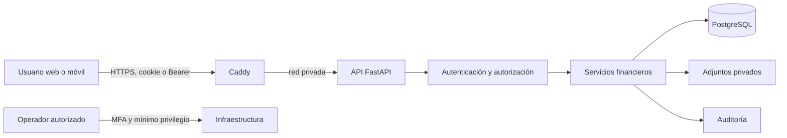

# Seguridad de producción de FinanceOS

## Estado y alcance

FinanceOS aplica defensa en profundidad en la API, pero **todavía no debe
considerarse listo para producción pública**. El código local cubre autenticación,
MFA, aislamiento por usuario, control de origen, límites de abuso, validación de
archivos, sesiones revocables, auditoría funcional y despliegue endurecido. Antes
de recibir información financiera real faltan controles operativos que no pueden
simularse desde el repositorio: dominio y TLS reales, gestor de secretos,
monitoreo externo, respaldos cifrados e inmutables y pentest independiente.

## Modelo de amenazas resumido

Activos críticos: credenciales, sesiones, claves MFA, movimientos, saldos,
adjuntos, respaldos y registros de auditoría. Los límites de confianza están en
el dispositivo, el proxy, la API, la persistencia y la operación. Los escenarios
prioritarios son robo de sesión, acceso horizontal, fuerza bruta, carga maliciosa,
duplicación de operaciones, abuso de recursos, fuga de secretos y compromiso de
una cuenta administrativa.

## Controles verificables en el repositorio

- Argon2 para contraseñas, MFA TOTP cifrado y códigos no reutilizables.
- Cookies `HttpOnly`, `Secure` en HTTPS y `SameSite=Strict`; Bearer para móvil.
- Sesiones con expiración absoluta, inactividad, listado y revocación.
- Propiedad de datos aplicada en servidor y administración separada.
- CORS y hosts explícitos, defensa de origen para mutaciones con cookie.
- Cabeceras CSP, anti-clickjacking, no-sniff, políticas de referencia,
  permisos y aislamiento de origen, incluso en respuestas de rechazo.
- Límite de solicitud en proxy y API; límites específicos para adjuntos.
- PDF e imágenes reconstruidos/saneados, rutas aleatorias y almacenamiento fuera
  del frontend.
- ORM, esquemas cerrados, importes acotados e idempotencia en flujos sensibles.
- Contenedor sin privilegios, capacidades eliminadas, filesystem de solo lectura
  y límites de CPU, memoria y procesos.
- CI con pruebas y auditorías de dependencias de Python y npm.

## Matriz mínima de roles

| Capacidad | Usuario | Administrador | Superadministrador |
| --- | ---: | ---: | ---: |
| Datos financieros propios | Sí | Sí | Sí |
| Datos de otro usuario | No | No | No por defecto |
| Crear/desactivar usuarios | No | Sí | Sí |
| Respaldos y restauración | No | No | Sí |
| Configuración de infraestructura | No | No | Fuera de la aplicación |

Toda comprobación se realiza en la API. Ocultar un botón nunca concede ni
revoca permisos.

## Configuración obligatoria

1. Desplegar únicamente `compose.production.yml`, con Caddy como único servicio
   público y PostgreSQL sin puerto expuesto.
2. Generar secretos únicos por ambiente y guardarlos fuera de Git. Rotar de
   inmediato cualquier secreto expuesto.
3. Configurar `FINANCEOS_PUBLIC_URL`, CORS y hosts con el dominio HTTPS exacto.
4. Mantener el registro público desactivado salvo que el producto tenga un flujo
   de alta, verificación y protección contra abuso aprobado.
5. Activar MFA para toda cuenta administrativa antes de operar.
6. Enviar logs a un destino con acceso restringido y alertar sobre bloqueos,
   cambios de rol, recuperación, MFA y operaciones administrativas.

## Respaldo y recuperación

- Objetivo inicial recomendado: RPO de 24 horas y RTO de 4 horas, sujeto a la
  necesidad comercial real.
- Cifrar en tránsito y reposo, conservar una copia separada e inmutable y limitar
  acceso a una identidad de respaldo.
- Probar restauración trimestralmente en un entorno aislado y registrar duración,
  integridad y responsable. Un archivo creado pero nunca restaurado no cuenta
  como respaldo verificado.

## Respuesta ante incidentes

1. Clasificar y contener: revocar sesiones, bloquear cuentas y aislar servicios.
2. Preservar evidencia sin copiar secretos ni datos personales innecesarios.
3. Rotar credenciales y claves afectadas, corregir la causa y restaurar desde una
   fuente verificada.
4. Determinar impacto, usuarios afectados y obligaciones de notificación.
5. Documentar causa raíz, acciones y pruebas que evitan la recurrencia.

Para credenciales filtradas se revocan todas las sesiones y se fuerzan nuevas
credenciales. Para ransomware no se sobrescribe evidencia: se aísla el entorno y
se restaura una copia inmutable verificada. Para acceso indebido se preservan los
identificadores de solicitud y registros de auditoría.

## Lista previa al lanzamiento

- [ ] Dominio, HTTPS y cabeceras comprobados desde Internet.
- [ ] Secretos en un gestor con rotación y responsables definidos.
- [ ] PostgreSQL, adjuntos y respaldos cifrados y no públicos.
- [ ] Restauración completa ejecutada con éxito.
- [ ] Alertas y retención de auditoría verificadas.
- [ ] MFA habilitado en administradores.
- [ ] CI verde y dependencias sin vulnerabilidades críticas/altas conocidas.
- [ ] Pruebas de aislamiento entre al menos dos usuarios.
- [ ] DAST controlado y pentest independiente terminados.
- [ ] Política de privacidad y obligaciones colombianas revisadas por asesoría
  jurídica competente.

## Riesgos residuales

- La CSP conserva `unsafe-inline` solo para estilos por compatibilidad con la UI;
  debe eliminarse cuando el frontend migre esos estilos a clases o nonces.
- El rate limiting persistente local reduce abuso, pero una publicación de varias
  réplicas necesita un almacén compartido y protección perimetral.
- El antivirus, WAF, mitigación DDoS, SIEM, cifrado gestionado y respaldos
  inmutables dependen del proveedor de infraestructura.
- Las pruebas automatizadas no equivalen a un pentest ni a una revisión legal.
